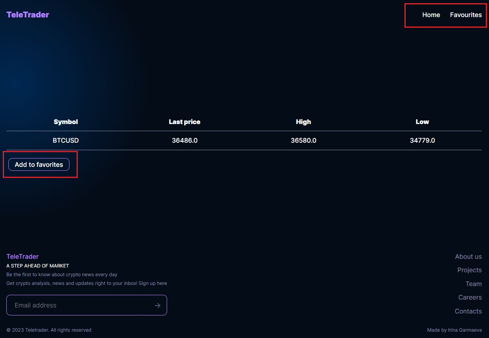
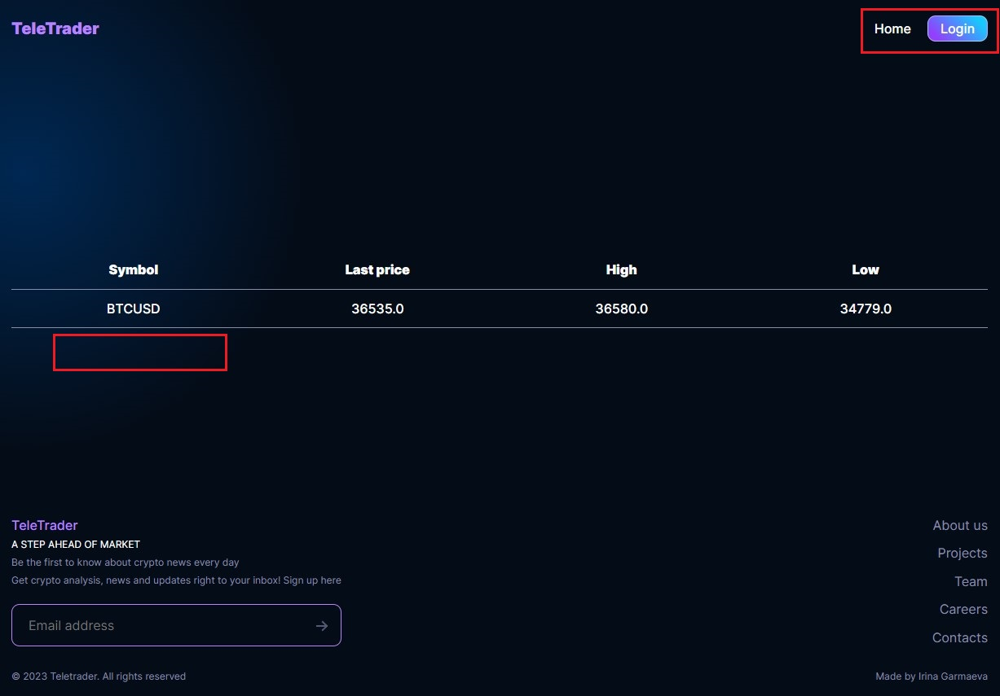
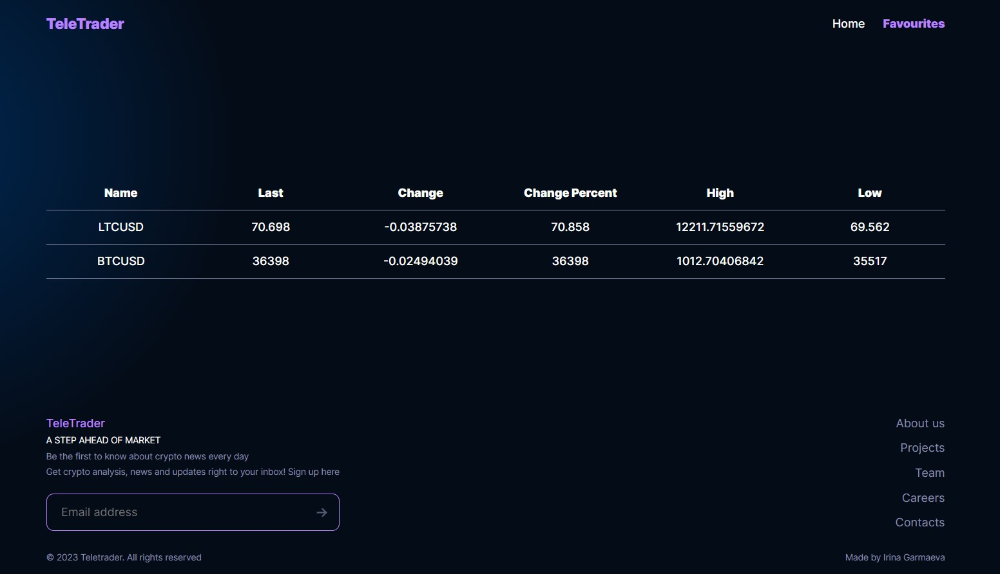
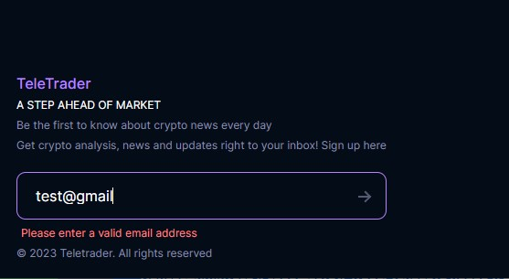

# Crypto Currency Monitoring App

Crypto Currency Monitoring App is a SPA test assignment project. The purpose of this test is to help TeleTrader ascertain the qualification and skill level of the prospective candidate applying for the Junior React Developer position.
The project itself is related to TeleTrader's core business, which revolves around developing applications for the financial industry.

## Description

This is a SPA built with React, Redux and [Bitfinex API](https://docs.bitfinex.com/docs). The application allows users to monitor the latest data for the top 5 cryptocurrencies. It provides real-time updates for cryptocurrency pairs from Bitfnex using WebSockets. Users can also view detailed information for individual currency pairs, add or remove pairs to/from their favorites list, and access a dedicated "Favorites" page that displays their selected pairs.

## Technologies

* React JS (Functional components, hooks)
* Redux Toolkit
* WebSockets
* Webpack
* HTML, BEM, CSS, Flexbox

## About The Project
<b>Home Page</b>

<b>Show all</b>

<b>Details Page for authorized users</b>

<b>Details Page for unauthorized users</b>

<b>Favourites Page</b>

<b>Live email validation</b>

## Functionality

### Login Simulation
Login functionality is simulated. After clicking the login button users are logged in forever and state should be persisted upon app close. There’s no logout functionality. The state of logged-in status is stored via local storage and react context.

### Home Page (`/`)
The home page displays information for the top 5 cryptocurrency pairs, including:

 - Cryptocurrency name
 - Last price
 - Daily change
 - Daily change percent
 - Daily high price
 - Daily low price

This data is updated in real-time via WebSocket connection to the Bitfnex API.

### Details Page (`/details/:symbol`)
Users can click on a cryptocurrency pair's name on the home page to navigate to the details page. The details page provides information for the selected currency pair, including:

 - Symbol (Cryptocurrency pair name)
 - Last price
 - Daily high price
 - Daily low price

This data doesn't update in real-time.

### Favorites (`/favourites`)
Logged-in users can manage their favorite cryptocurrency pairs by adding or removing pairs from their list. The state of favorite pairs is stored in Redux store, symbols (crypto pair names) are stored in local storage. This data should be persisted upon app close. This page also receives real-time updates via WebSocket connection.

### Subscribe Form
A subscribe form is available in the footer where users can input their email address to subscribe for news updates. Live validation of the email is implemented, and upon form submission, users receive a notification using window.alert().

### Additional Notes
**Context and Custom Hooks**: Utilized AuthContext and useWebSocket custom hook to manage user authentication and WebSocket connections for real-time data updates. The useWebSocket hook is extensively used in the Home and Favourites components to subscribe to WebSocket data and manage the state accordingly.

**Redux Implementation**: Implemented global state management using Redux Toolkit. The app utilizes Redux slices (tickersSlice) to manage cryptocurrency data across components. Sslice contains logic for managing changes in the state based on various actions triggered by WebSocket updates and user interactions.

**Proxy Server**: Implemented a proxy server to circumvent CORS issues when fetching data from [Bitfinex API](https://docs.bitfinex.com/docs).

## How to install and run locally

Clone repository:

  `git clone https://github.com/IrinaGarmaeva/teletrader-test-assignment`

Install dependencies:

  `npm install`

Run proxy server:

  `node proxy-server/setupProxyServer.js`

Run app:

  `npm run start`

Build app(production):

  `npm run build`

